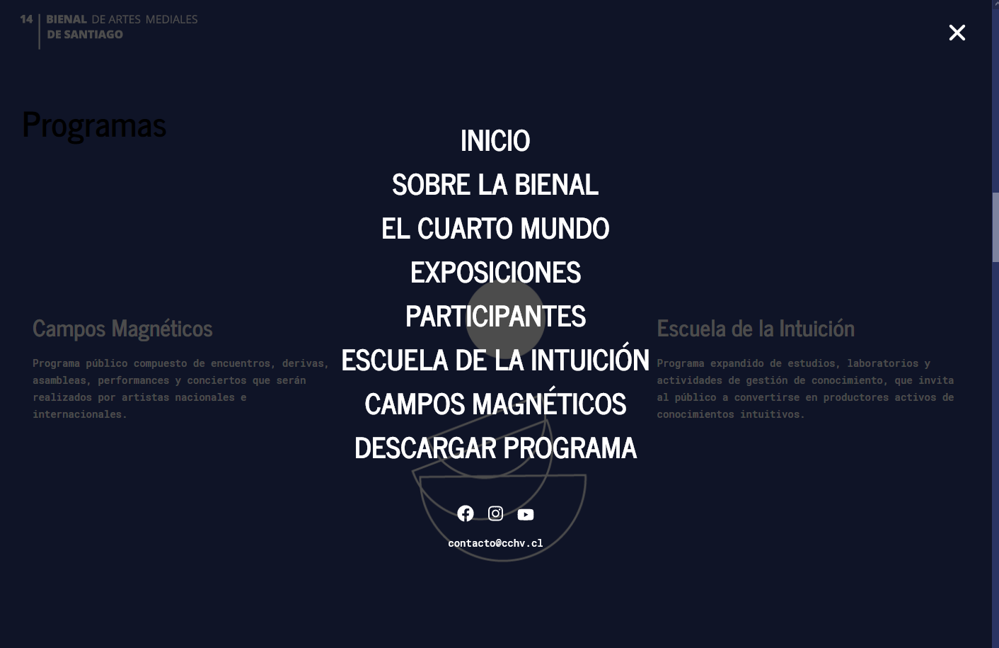
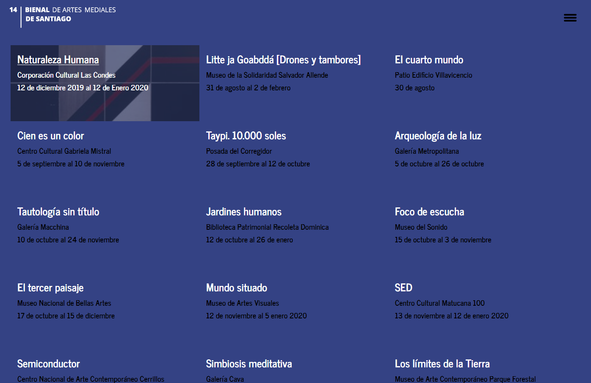

# 14 Bienal Artes Mediales web

[VueJS application](http://www.bienaldeartesmediales.cl/14/) written with typescript using wordpress as backend.






## Project setup

All project dependencies an be installed by either npm or yarn:

```
yarn install
```

### Wordpress ENV

This application relies on a wordpress API. This [Wordpress installation template](https://github.com/gilbitron/wp-rest-theme) structure is suggested, it makes available a global `wp` object available for use on `index.php`:

```javascript
 {
  root: "http://www.bienaldeartesmediales.cl/14/index.php/wp-json/",
  base_url: "http://www.bienaldeartesmediales.cl/14",
  base_path: "/14/",
  nonce: "8b61807833",
  site_name: "14 BAM",
  routes: [
    {
      id: 1,
      type: "post",
      slug: "hello-world"
    },
    {
      id: 2,
      type: "page",
      slug: "sample-page"
    }
  ]
}
```

All this variables can be used and injected to the VueJS application, if needed.

For testing purposes, [src/wpObjectMock.js](src/wpObjectMock.js) is used.

### Development

Environment flags are needed to enable specific features:

```
VUE_APP_BASE_URL // base url of the API
VUE_APP_GOOGLE_GEO_API // google geo api used to retrieve lat, lng values from addresses
VUE_APP_MAPBOX_PUBLIC_TOKEN // token to be able to display map on home page
VUE_APP_ASSETS_URL // public assets url on production, for example: if it's set to '/assets/', will look for public assets at origin.com/assets/
VUE_APP_GOOGLE_ANALYTICS // google analytics trackingId
```

They should be preferably defined on an `.env` file at the root folder. To start development server with hot reloading:

```
yarn run serve
```

### Compiles and minifies for production

```
yarn run build
```

### Customize configuration

See [Configuration Reference](https://cli.vuejs.org/config/).


### Next Steps

- [ ] check the use of vue-mq strings on views, maybe we can use enums?
- [ ] fix download program button